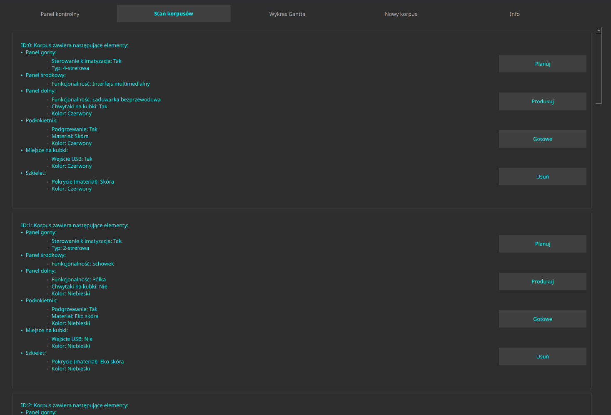
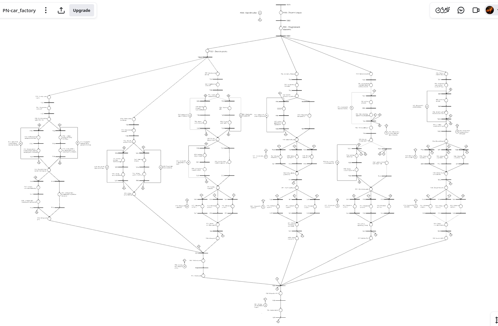
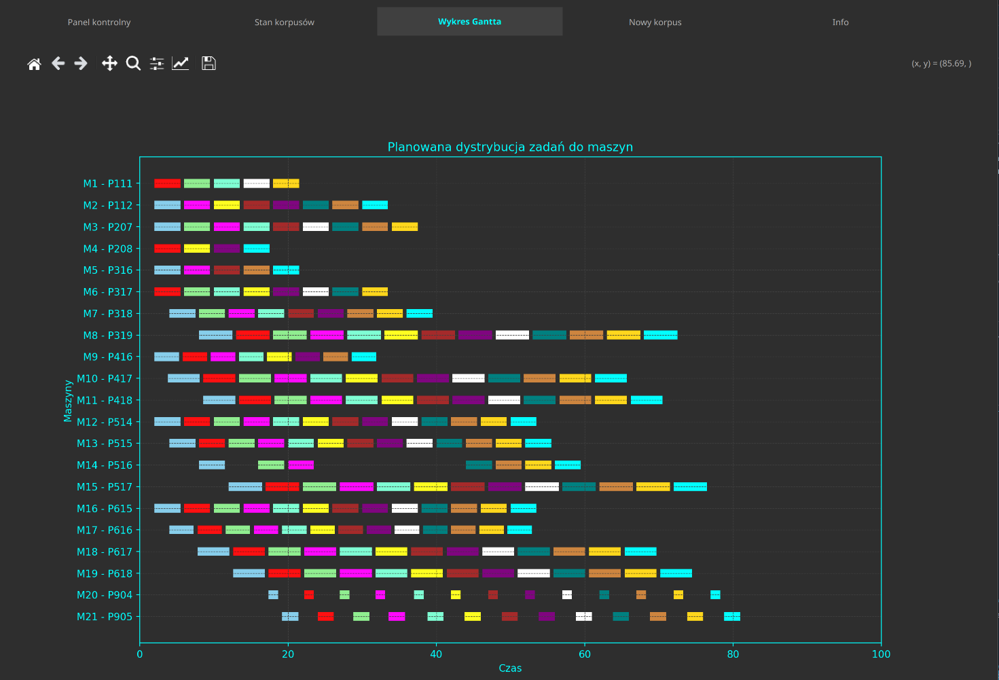

# PN-Car-Body-App

> **Petri Net-Based Car Body Production Simulator**

A discrete-event simulation tool for modeling and optimizing car body interior assembly processes. Developed as an engineering thesis project at **Wrocław University of Science and Technology**.

## Overview

Modern automotive manufacturing demands flexible, data-driven production planning. **PN-Car-Body-App** addresses this challenge by combining [Petri net](https://en.wikipedia.org/wiki/Petri_net) theory with an intuitive graphical interface to simulate the assembly of modular car body interior components — such as panels, armrests, cup holders, and frameworks.

The application functions as a lightweight [digital twin](https://en.wikipedia.org/wiki/Digital_twin), enabling engineers to:

- **Model** production workflows using Place/Transition (PT) nets.
- **Simulate** discrete manufacturing events and resource constraints.
- **Visualize** planned schedules via interactive Gantt charts.
- **Optimize** sequencing for large batches of highly configurable products.


## Screenshots

| Car Bodies Configuration | Petri Net Model | Gantt Chart Schedule |
|:------------------------:|:---------------:|:--------------------:|
|  |  |  |


## Key Features

| Feature | Description |
|---------|-------------|
| **JSON-Based Input** | Load batch definitions from `bodies.json` or create new configurations directly in the UI. |
| **Petri Net Engine** | Mathematically rigorous PT-net model captures concurrency, synchronization, and resource allocation. |
| **Gantt Chart Visualization** | Clear timeline view of the planned production sequence. |
| **Digital Twin Concept** | Run simulations to forecast production metrics and feed insights back into real-world scheduling. |
| **Modular Architecture** | Easily extendable component library (panels, armrests, cup holders, frameworks). |


## Quick Start

### Prerequisites

- Python 3.10+
- [Poetry](https://python-poetry.org/) (dependency management)
- Qt5 libraries (for PyQt5 GUI)

### Installation

```bash
# Clone the repository
git clone https://github.com/Mastej-Git/PN-Car-Body-App.git
cd PN-Car-Body-App

# Set up virtual environment and install dependencies
make setup-env

# Launch the application
make run
```


## Project Structure

```
PN-Car-Body-App/
├── main.py                 # Application entry point
├── body_parts/             # Component models (Armrest, Panel, Framework, …)
├── petri_nets/             # Petri net engine (Place, Transition, PetriNet)
├── qt_classes/             # PyQt5 GUI components
├── other/                  # Utilities (JSON reader, Gantt chart, workers)
├── enums/                  # Enumerations (materials, stylesheets)
├── tests/                  # Unit tests
├── docs/                   # Documentation & figures
│   ├── engineering_thesis.pdf
│   └── figures/
└── bodies.json             # Sample car body definitions
```

## Technology Stack

| Tool | Purpose |
|------|---------|
| [Python 3](https://www.python.org/) | Core language |
| [Poetry](https://python-poetry.org/) | Dependency & environment management |
| [PyQt5](https://riverbankcomputing.com/software/pyqt/) | Cross-platform GUI framework |
| [Matplotlib](https://matplotlib.org/) | Gantt chart rendering |
| [Ruff](https://docs.astral.sh/ruff/) | Linting & formatting |
| [Pylint](https://pylint.org/) | Static code analysis |


## Running Tests

```bash
make test
# or
poetry run pytest tests/
```


## Documentation

The full engineering thesis describing the theoretical background, system design, and experimental results is available at:

📄 **[`docs/engineering_thesis.pdf`](docs/engineering_thesis.pdf)**


## License

This project was developed for academic purposes. Please contact the author for licensing inquiries.

